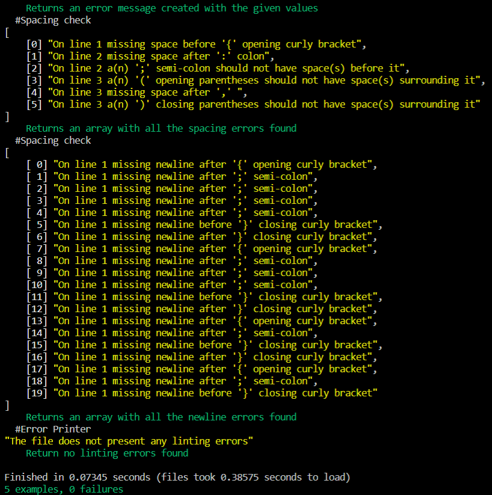

[![Contributors][contributors-shield]][contributors-url]
[![Forks][forks-shield]][forks-url]
[![Stargazers][stars-shield]][stars-url]
[![Issues][issues-shield]][issues-url]

<!-- PROJECT LOGO -->
<br />
<p align="center">
  <a href="https://github.com/e71az/Ruby-capstone">
    
  </a>

  <h2 align="center">Basic CSS Linter</h2>

  <h3 align="center">Ruby Capstone Project --> Build your own linter<h3>
  <p align="center">
    <a href="https://github.com/e71az/Ruby-capstone"><strong>Explore the docs »</strong></a>
    <br />
    <br />
    -
    <a href="https://github.com/e71az/Ruby-capstone/issues">Report a Bug</a>
    -
    <a href="https://github.com/e71az/Ruby-capstone/issues">Request a Feature</a>
    -
  </p>
</p>

<!-- TABLE OF CONTENTS -->
## Table of Contents

* [About the Project](#about-the-project)
  * [Built With](#built-with)
  * [Rules](#rules)
  * [Usage](#usage)
  * [Automated Test](#autoamted-test)
* [Video Presentation](#video-presentation)
* [Contributors](#contributors)
* [Contributing](#contributing)
* [Acknowledgements](#acknowledgements)
* [License](#license)

<!-- ABOUT THE PROJECT -->
## About The Project

This is the **Ruby Capstone Project** required at the end of the **Ruby** module.
Specifically it is a **CSS Linter** with the purpose to check for spacing and format errors.
The goal of this project was to apply all the ruby knowledge learned in one small and simple project, the requirements were provided
by a fictional client, I received what the client wanted and translated that to code. In this case I was required to create a linter,
I proceeded to create one specifically for the CSS language.

## Rules

**Line Format**
* One line checking

bad code:
```css
h1{font-size: 35px;font-weight:normal;margin-top:5px;}
```

good code:
```css
h1 {
  font-size: 35px;
  font-weight: normal;
  margin-top: 5px;
}
```

**Spacing**
* Checking for missing spacing after **:** or **,**
* Checking for missing spacing before **{**
* Checking for line break after **{** or **}** and after each property declaration

bad code:

```css
body{margin:25px;
  background-color:rgb ( 240,240,240 ) ;
  font-family:arial,sans-serif;
  font-size:14px;}
```

good code:
```css
body {
  margin: 25px;
  background-color: rgb(240, 240, 240);
  font-family: arial, sans-serif;
  font-size: 14px;
}
```

**EOF newline**
* Checks whether a newline at the end of the file exists.

bad code:

```css
#someid {
  color: green;
} /* Last line */
```

good code:
```css
#someid {
  color: green;
}
/* Last line */
```

## Usage

The **_CSS Linter_** checks for basic syntax errors, if it finds any it will return an error with a
text to the user indicating in which line and what error it detected as well as a count of
the errors found.

**Examples**

- [0] "On line 1 missing space before '{' opening curly bracket",
- [1] "On line 1 missing newline after '{' opening curly bracket",
- [2] "On line 2 a(n) '(' opening parentheses should not have space(s) surrounding it",
- [3] "On line 2 a(n) ')' closing parentheses should not have space(s) surrounding it",
- [4] "On line 5 missing newline after '}' closing curly bracket",
- [5] "On line 7 missing space after ':' colon",
- [6] "On line 8 missing newline after ';' semi-colon",
- [7] "On line 17 missing newline after '}' closing curly bracket"

To test out **CSS Linter** you need to:
* have **Ruby** installed on your computer
* Clone this repo:
  - Clone with SSH:
  ```
  git@github.com:e71az/Ruby-capstone.git
  ```
  - Clone with HTTPS:
  ```
  https://github.com/e71az/Ruby-capstone.git
  ```
* Navigate to root directory of the repo and run:
```
$ bin/main

Provide a file to check, otherwise the sample.css will be used: path_to_file.css <!-- (path_to_file.css being the file you want to check for linters, leave blank and click enter if you want to use the default file included) -->

```


**Automated Test**
* Run the command and see the output
```
$ rspec
```


### Built With
This project was built using these technologies.
* Ruby
* Rspec
* Rubocop
* Strscan
* Awesome print

## Video Presentation

Check out full presentation [here](https://www.loom.com)

## Potential future features
- Add more advanced linting rules

## Contributors

👤 **Elias Castañeda**

- Github: [@e71az](https://github.com/e71az)
- Linkedin: [@e71az](https://www.linkedin.com/in/e71az/)
- Twitter: [@e71az](https://twitter.com/e71az)

## :handshake: Contributing
Contributions, issues and feature requests are welcome!
Feel free to check the [issues page](https://github.com/e71az/Ruby-capstone/issues)

## Show your support
Give a :star: if you like this project!

<!-- MARKDOWN LINKS & IMAGES -->
<!-- https://www.markdownguide.org/basic-syntax/#reference-style-links -->
[contributors-shield]: https://img.shields.io/github/contributors/e71az/Ruby-capstone.svg?style=flat-square
[contributors-url]: https://github.com/e71az/Ruby-capstone/graphs/contributors
[forks-shield]: https://img.shields.io/github/forks/e71az/Ruby-capstone
[forks-url]: https://github.com/e71az/Ruby-capstone/network/members
[stars-shield]: https://img.shields.io/github/stars/e71az/Ruby-capstone
[stars-url]: https://github.com/e71az/Ruby-capstone/stargazers
[issues-shield]: https://img.shields.io/github/issues/e71az/Ruby-capstone.svg?style=flat-square
[issues-url]: https://github.com/e71az/Ruby-capstone/issues

## 📝 License

This project is [MIT](https://opensource.org/licenses/MIT) licensed.
